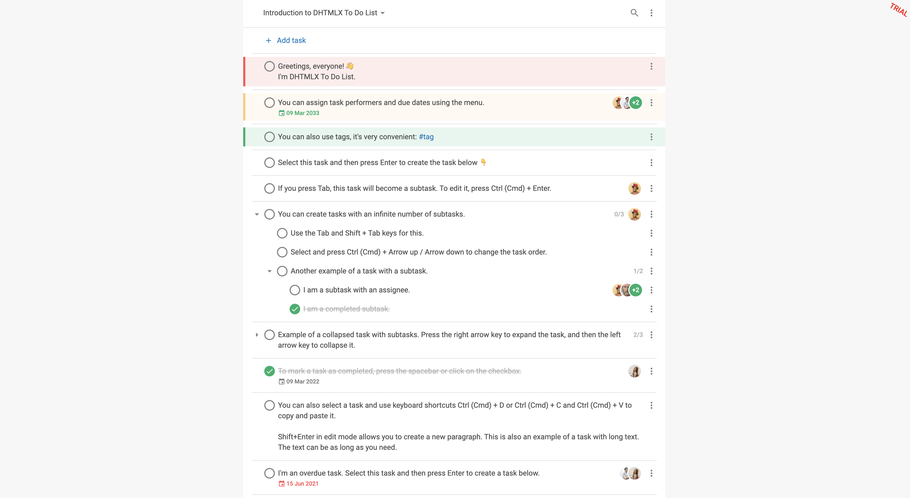

# DHTMLX To Do List with Vue Demo

[](https://dhtmlx.com/)

[How to start](#how-to-start) | [Key features](#key-features) | [License](#license) | [Useful links](#links) | [Other examples](#examples) | [Join our online community](#join)



The DHTMLX [JavaScript To Do List](https://dhtmlx.com/docs/products/dhtmlxTodo/) widget allows building a web app for effective task management. It has a clean, minimalist design that makes it easy for end-users to organize their business processes without unnecessary complexity.

<a name="how-to-start"></a>
## How to start

### Online

[](https://codespaces.new/DHTMLX/vue-todolist-demo)

**Please note**, having clicked on this button, you open the **online demo. Don't worry about paying extra!** With GitHub's free plan, [you get 15 GB of storage and 120 hours of Codespaces use each month](https://docs.github.com/en/billing/managing-billing-for-github-codespaces/about-billing-for-github-codespaces#monthly-included-storage-and-core-hours-for-personal-accounts). This is more than enough to run our demo without any extra costs.

### On the local host 

Clone the repository or download files.

```
yarn
yarn start
```

or

```
npm install
npm run start
```

<a name="key-features"></a>
## DHTMLX To Do List key features

- Rich JavaScript API
- Drag-n-drop support
- Improved keyboard navigation
- Convenient work with project and tasks (adding new projects and switching between them, editing, deleting, etc.)
- Integrating a multi-user backend
  
[](https://snippet.dhtmlx.com/82ayq2lk?tag=todolist&mode=wide)

- Setting due dates
- Expanding/collapsing tasks and subtasks
- Sorting tasks by various criteria (priority, due date, etc.)
- Using hashtags
  
[](https://snippet.dhtmlx.com/5cymicwt?tag=todolist&mode=wide)

- Different modes of marking tasks completed
- Calculating the number of completed subtasks
- Estimating the percentage of the task completed
- Full customization via CSS

<a name="license"></a>
## License ##
This demo is available under the Evaluation license. To use it in your projects, please choose a proper license on the DHTMLX website: [https://dhtmlx.com/docs/products/licenses.shtml](https://dhtmlx.com/docs/products/licenses.shtml)

<a name="links"></a>
## Useful links

- [More demos about the DHTMLX To Do List functionality](https://snippet.dhtmlx.com/3vwlbwee?tag=todolist)
- [Technical support](https://forum.dhtmlx.com/c/todo)
- [Online  documentation](https://docs.dhtmlx.com/todolist/)

<a name="examples"></a>
## Other examples

Check out examples of using DHTMLX To Do List with other technologies:

| JavaScript | Angular | React | Svelte |
| ----- | ----- | ----- | ----- |
| [](https://dhtmlx.com/docs/products/dhtmlxTodo/) | [](https://github.com/DHTMLX/angular-todolist-demo) | [](https://github.com/DHTMLX/react-todolist-demo) | [](https://github.com/DHTMLX/svelte-todolist-demo) |

<a name="join"></a>
## Join our online community

- Star our GitHub repo :star:
- Watch our tutorials on [YouTube](https://www.youtube.com/user/dhtmlx/videos) :tv:
- Read us on [Medium](https://dhtmlx.medium.com) :newspaper:
- Follow us on [X](https://x.com/dhtmlx) :bird:
- Check our news and updates on [Facebook](https://www.facebook.com/dhtmlx/) :feet:
